# hey, I'm Dio 👋

  

Senior backend engineer from Portugal with **9+ years** building production systems.

These days I'm on a **career break**, exploring **game development in Godot** and prototyping a gardening game 🌱

| GitHub Stats | Most Used Languages |
| --- | --- |
|  |  |

## whoami

- spent the last decade building and operating **event-driven .NET systems**, messaging-heavy services, internal platforms, and tooling
- worked across **travel/customs integrations**, **finance & loan-management platforms**, **telecom/contact-center tooling**, and earlier **Android/public-sector apps**
- care a lot about **reliability**, **observability**, and architecture that survives contact with production
- some of my best professional work lives in private company repos, so this profile focuses on the parts I can actually show in public

## featured things people can use

## toolbox

### languages

### backend & web

### messaging, observability & infra

### data & persistence

### frontend, mobile & game dev

### tooling & practices

## support

---

*The interesting bits are the distributed systems, developer tooling, and the fact that I'm currently seeing how much gardening game energy I can squeeze out of Godot.*
